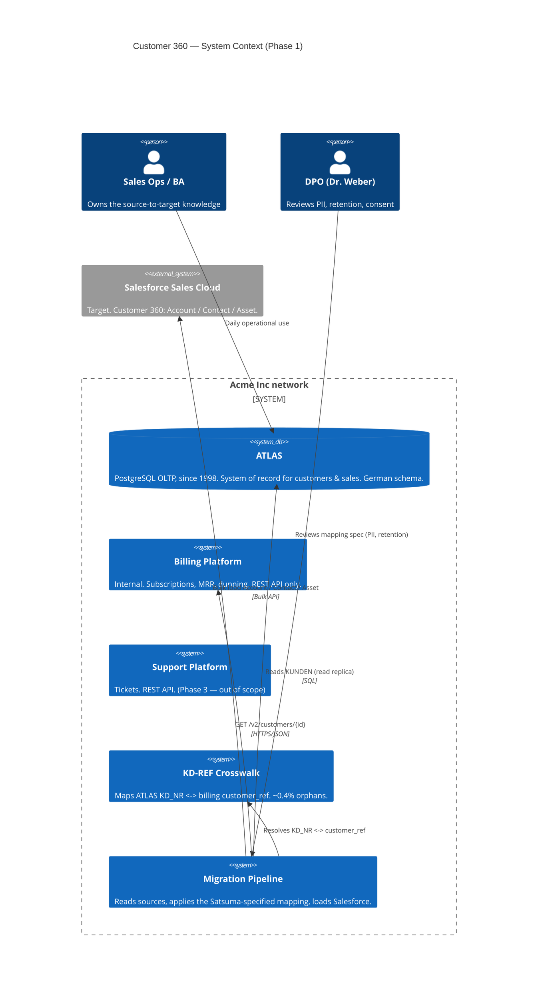
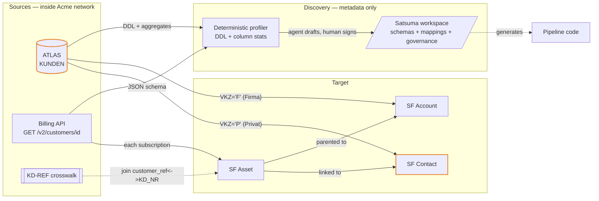

# Architecture Overview — Customer 360 Migration

| | |
|---|---|
| **Author** | Markus Brandt (Solution Architect) |
| **Status** | Discovery baseline |
| **Last review** | 2026-06-09 |
| **Scope** | Phase 1 — Customers + Billing into Salesforce |

> This is the architect's view of *which systems exist, who owns them, and how
> data flows* for the migration. It is the source of the "what are the sources
> and targets" decision encoded in the Satsuma `schema` declarations and
> `mapping source { } / target { }` blocks. It is intentionally a **drawing** —
> drawings drift; the spec does not.

---

## 1. System context (Mermaid C4)



---

## 2. Container / data-flow view (Mermaid)



> **Reading note for the talk:** the `DISC` box is the whole argument. Only
> *metadata and aggregates* cross from `SRC` into discovery — never customer
> rows (constraint C2 / doc 06). The Satsuma workspace is the single artifact
> that the pipeline is generated *from* and that the DPO reviews.

---

## 3. System landscape (LikeC4)

```likec4 
specification {
  element actor {
    style { shape person }
  }
  element system
  element store
  element api
  element component

  tag pii
  tag phase1
  tag out-of-scope
}

model {
  sabine = actor 'Sabine (BA / Sales Ops)' {
    description 'Owns source-to-target knowledge; resolves open questions.'
  }
  weber = actor 'Dr. Weber (DPO)' {
    description 'Reviews PII, retention, consent; signs the Art. 30 record.'
  }

  acme = system 'Acme Inc Estate' {

    atlas = store 'ATLAS' {
      #pii #phase1
      description '
        PostgreSQL OLTP, since 1998. System of record for customers and sales.
        German schema (KUNDEN, AUFTRAEGE, ANSPRECHPARTNER). ~331k customers.
      '
      technology 'PostgreSQL 12'
    }

    billing = api 'Billing Platform API' {
      #phase1
      description 'Subscriptions, MRR, dunning status. REST/JSON. Single currency (EUR).'
      technology 'REST'
    }

    support = api 'Support Platform API' {
      #out-of-scope
      description 'Tickets. Phase 3 — not analysed in this discovery.'
    }

    crosswalk = store 'KD-REF Crosswalk' {
      #phase1
      description 'Maps ATLAS KD_NR <-> billing customer_ref. ~0.4% orphan refs route to remediation.'
    }

    pipeline = system 'Migration Pipeline' {
      #phase1
      description '
        Reads sources, applies the Satsuma-specified mapping, loads Salesforce.
        Generated from the spec; never improvised against the spreadsheet.
      '

      profiler = component 'Metadata Profiler' {
        description 'Deterministic. Emits DDL + column statistics only — no customer rows leave the network.'
      }
      spec = component 'Satsuma Workspace' {
        #pii
        description 'schemas + mappings + governance. The reviewed, machine-checkable specification.'
      }
    }
  }

  salesforce = system 'Salesforce Sales Cloud' {
    #pii #phase1
    description 'Target. Customer 360: Account / Contact / Asset.'
  }

  // --- relationships ---
  sabine -> atlas 'operates daily'
  atlas -> pipeline.profiler 'DDL + aggregates'
  billing -> pipeline.profiler 'JSON schema'
  pipeline.profiler -> pipeline.spec 'agent drafts, human signs'
  pipeline.spec -> salesforce 'generates load for'
  crosswalk -> pipeline.spec 'join policy recorded in spec'
  weber -> pipeline.spec 'reviews PII + retention'
}

views {
  view landscape {
    title 'Customer 360 — landscape'
    include *
  }

  view phase1 {
    title 'Phase 1 only'
    include
      element.tag = #phase1,
      sabine, weber
  }
}
```

---

## 4. Integration patterns & decisions

| Decision | Choice | Rationale |
|---|---|---|
| ATLAS access | Read replica, DDL + profiling | C2: keep customer rows inside Acme; never sample to a model |
| Billing access | REST `GET /v2/customers/{id}`, batched by customer | API-only system; no DB access available |
| Identity / linking | `KD-REF` crosswalk table (KD_NR ↔ customer_ref) | No shared key between ATLAS and billing; crosswalk is authoritative |
| Customer split | `VKZ = 'F'` → Account, `VKZ = 'P'` → Contact | ATLAS overloads one table for companies *and* people (doc 03) |
| Asset fan-out | One SF Asset per billing subscription (`each`) | Subscriptions are a nested list — unrepresentable as a flat row |
| Currency | EUR only, no conversion | C4: billing platform is single-currency |

### Known architectural risks (carried into the spec as notes/questions)

- **R1 — Asset parentage.** SF Assets need an Account *or* Contact parent. The
  Account mapping (`VKZ = 'F'`) is Phase-1 scope but not yet authored when the
  Asset mapping is drafted → surfaces in the spec as a `//?` on `sf_asset.AccountId`.
- **R2 — Crosswalk orphans.** ~0.4% of billing refs have no ATLAS match →
  recorded in the `billing to assets` source block with a remediation route.
- **R3 — Picklist parity.** Target picklists (e.g. `Familie`) must exist in the
  org before load (C5); the spec declares them but cannot validate org metadata.
