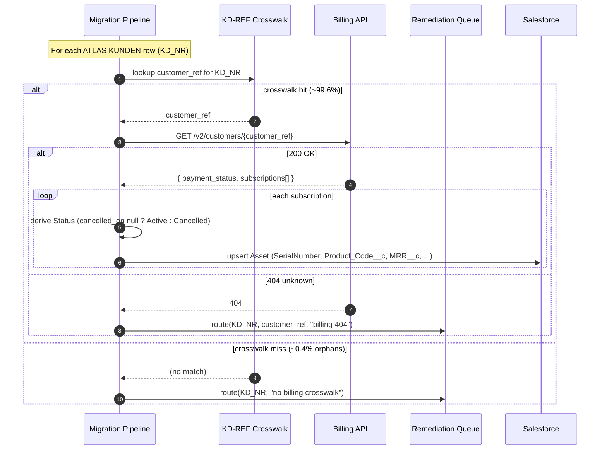

# Billing Platform API — Source Analysis

| | |
|---|---|
| **System** | Internal Billing Platform (REST API only; no DB access) |
| **Analysts** | Priya Nair + discovery agent |
| **Method** | OpenAPI spec review + response-shape sampling against a sandbox tenant |
| **Data handling** | Schema + shape only; sampled against synthetic sandbox customers (constraint C2) |
| **Last review** | 2026-06-10 |

> The billing platform is the source that *always died in the spreadsheet*: its
> response is **nested JSON**, and a flat grid can only say "see tab 4". This
> analysis yields `schema billing_api_customer` (with its `subscriptions
> list_of record`) and the `billing to assets` mapping, including the crosswalk
> join and its known orphan rate.

---

## 1. Endpoint

```
GET /v2/customers/{id}
Host: billing.internal.acme.example
Auth: service token (mTLS inside Acme network)
Returns: 200 application/json  | 404 unknown customer
```

`{id}` is the **billing `customer_ref`**, *not* the ATLAS `KD_NR`. The two are
related only through the `KD-REF` crosswalk (§4). This mismatch is the central
integration fact.

---

## 2. Response schema (OpenAPI fragment)

```yaml
# Billing Platform — OpenAPI 3.1 (excerpt)
components:
  schemas:
    Customer:
      type: object
      required: [customer_ref, payment_status]
      properties:
        customer_ref:
          type: string
          maxLength: 20
          description: Billing-side customer identifier.
        payment_status:
          type: string
          maxLength: 12
          enum: [ok, dunning_1, dunning_2, legal]
          description: Dunning lifecycle. 'legal' = handed to legal collections.
        subscriptions:
          type: array
          items: { $ref: '#/components/schemas/Subscription' }

    Subscription:
      type: object
      required: [contract_no, product_code]
      properties:
        contract_no:
          type: string
          maxLength: 15
          description: Contract number. Unique per subscription (effective PK).
        product_code:
          type: string
          maxLength: 10
        mrr_eur:
          type: number
          format: decimal           # 10,2 — EUR only, single-currency platform
          description: Monthly recurring revenue, EUR.
        started_on:
          type: string
          format: date
        cancelled_on:
          type: string
          format: date
          nullable: true
          description: Null while the subscription is active.
```

→ Spec distillation:

```satsuma
schema billing_api_customer (note "GET /v2/customers/{id} — billing platform") {
  customer_ref   STRING(20)  (required)
  payment_status STRING(12)  (enum {ok, dunning_1, dunning_2, legal})
  subscriptions list_of record {
    contract_no  STRING(15)  (pk)
    product_code STRING(10)
    mrr_eur      DECIMAL(10,2)
    started_on   DATE
    cancelled_on DATE        (note "null while active")
  }
}
```

---

## 3. Example response (synthetic / sandbox)

```json
{
  "customer_ref": "BIL-0099217",
  "payment_status": "dunning_1",
  "subscriptions": [
    { "contract_no": "C-2021-04417", "product_code": "SENS-PRO",
      "mrr_eur": 480.00, "started_on": "2021-03-01", "cancelled_on": null },
    { "contract_no": "C-2019-00231", "product_code": "SENS-LITE",
      "mrr_eur": 120.00, "started_on": "2019-07-15", "cancelled_on": "2023-12-31" }
  ]
}
```

One customer → **many** subscriptions. Each subscription becomes one Salesforce
Asset. `cancelled_on = null` ⇒ Active; otherwise Cancelled. This is the
`each subscriptions -> sf_asset` fan-out and the `Status` derivation in the spec.

---

## 4. The `KD-REF` crosswalk (the join that must be written down)

There is **no shared key** between ATLAS and billing. Linking customers to their
billing data goes through a separate crosswalk table:

| Column | Side | Notes |
|---|---|---|
| `KD_NR` | ATLAS | integer customer number |
| `CUSTOMER_REF` | Billing | `STRING(20)`, e.g. `BIL-0099217` |

**Profiling of the crosswalk:**

- ~99.6% of billing `customer_ref` values resolve to exactly one ATLAS `KD_NR`.
- **~0.4% are orphans** — a billing ref with no ATLAS match (legacy
  test accounts, a 2016 billing-system migration residue, and a handful of
  genuinely missing customers).

**Decision:** orphans are **not dropped silently**. They route to a remediation
queue for manual resolution before go-live.

→ This entire paragraph is what lives in the `billing to assets` **source
block** of the spec — not in Priya's head:

```satsuma
mapping `billing to assets` {
  source {
    billing_api_customer
    atlas_kunden
    "Match @billing_api_customer.customer_ref to @atlas_kunden.KD_NR via the
     KD-REF crosswalk table; ~0.4% of refs are orphans — route to remediation."
  }
  target { sf_asset }
  ...
}
```

---

## 5. Sequence — how the pipeline assembles a customer's assets (Mermaid)



> The two `route → Remediation` paths are exactly the "0.4% orphans" and the
> 404s. The spec records *that they exist and where they go*; the pipeline
> (generated from the spec) implements the routing.

---

## 6. Open questions (the `//?` queue from this source)

| # | Question | Lands as |
|---|---|---|
| Q1 | **Asset parentage.** SF Assets require an Account *or* Contact parent. Companies (`VKZ='F'`) → Account, but the Account mapping is not authored yet. Where do company-owned assets parent? | `//?` on `sf_asset.AccountId` (doc 05) |
| Q2 | **Product crosswalk.** `product_code` (e.g. `SENS-PRO`) must resolve to a Salesforce `Product2`. Is there a product master crosswalk, or is this Phase 2? | `note` on `sf_asset.Product2Id` |
| Q3 | **`payment_status = 'legal'`** customers — do they migrate at all, or are they held? Business decision, not a mapping decision. | open — for the workshop |

---

## 7. What this document contributes to the spec

- `schema billing_api_customer` with the nested `subscriptions list_of record`
  (§2) — the structural fan-out a spreadsheet cannot hold.
- The `each subscriptions -> sf_asset` block and the `Status` derivation (§3).
- The crosswalk join, the **0.4% orphan rate**, and the remediation route,
  written into the `source { }` block where they cannot be lost (§4–§5).
