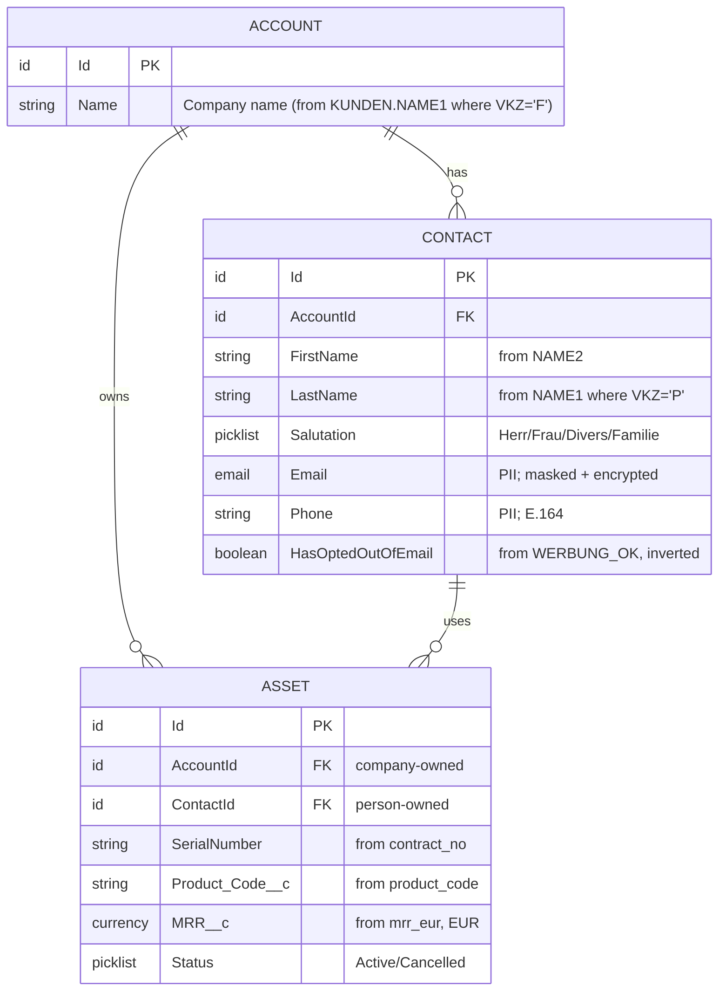

# Salesforce Target Model — Customer 360

| | |
|---|---|
| **Author** | Markus Brandt (architect) + Salesforce admin |
| **Source** | Salesforce org metadata (Metadata API) + design decisions |
| **Status** | Phase 1 target baseline |
| **Last review** | 2026-06-11 |

> This is the *target* side of the migration: the Salesforce objects, their
> fields, and — critically — the **picklist value sets** and **required
> fields** the source data must be coerced into. It yields `schema sf_contact`
> and `schema sf_asset` and the picklist `{Herr, Frau, Divers, Familie}`.
>
> Reminder (constraint C5): the spec may *declare* these objects and picklists,
> but the values must exist in the target org before load. Org-side validation
> is a deployment-time check the spec enables but does not itself perform.

---

## 1. Target object model (Mermaid ER)



> **Account is referenced but not authored in Phase 1's mapping file** (it is
> `VKZ='F'` scope, scheduled but pending). This is why `sf_asset.AccountId`
> carries a `//?` in the spec: the parent target exists in the model, but the
> mapping that populates it does not yet.

---

## 2. `sf_contact` — field definitions

| Field | SF type | Length | Required | Governance | Source |
|---|---|---|---|---|---|
| `Email` | Email | 80 | no | **PII**, mask `partial_email`, encrypt AES-256-GCM | `KUNDEN.EMAIL` (cleaned) |
| `FirstName` | Text | 40 | no | — | `KUNDEN.NAME2` |
| `LastName` | Text | 80 | **yes** | — | `KUNDEN.NAME1` (where `VKZ='P'`) |
| `Salutation` | Picklist | — | no | — | `KUNDEN.ANREDE` (mapped) |
| `Phone` | Phone | 40 | no | **PII**, E.164 | `KUNDEN.TELEFON` (normalised) |
| `HasOptedOutOfEmail` | Checkbox | — | **yes** | consent (DPO-reviewed) | `KUNDEN.WERBUNG_OK` (inverted) |

### 2.1 `Salutation` picklist — value set

The target org's `Salutation` picklist is configured with **exactly** these
values for the migration:

```
Herr | Frau | Divers | Familie
```

The first three are standard German salutations. **`Familie`** was added
specifically to receive the ATLAS `ANREDE='X'` rows once sales ops confirmed
their meaning (couples/family addressing — see doc 03 §3.1). Picklist parity is
a hard go-live gate (C5).

→ Spec: `Salutation PICKLIST (enum {Herr, Frau, Divers, Familie})`.

### 2.2 The consent field — a deliberate inversion

ATLAS stores **consent to receive marketing** (`WERBUNG_OK`: `J`/`N`).
Salesforce stores the **opposite polarity**: `HasOptedOutOfEmail`.

| ATLAS `WERBUNG_OK` | Meaning | SF `HasOptedOutOfEmail` |
|---|---|---|
| `J` | consented | `false` |
| `N` | did not consent | `true` |
| null | unknown | `true` (absence of consent ⇒ opted out) |

This polarity flip is a classic one-character bug. Captured explicitly so the
DPO can sign off the legal rationale (doc 06). → the `map { J: false, N: true,
null: true }` block.

---

## 3. `sf_asset` — field definitions

One Asset per billing subscription. Custom fields (`__c`) carry billing
attributes.

| Field | SF type | Required | Source / note |
|---|---|---|---|
| `Id` | Id | (pk) | SF-assigned |
| `Name` | Text(255) | **yes** | derived from product + contract no (SF requires Name) |
| `AccountId` | Lookup(Account) | one of Account/Contact | **`//?` — company asset parentage pending** |
| `ContactId` | Lookup(Contact) | one of Account/Contact | person-owned assets |
| `Product2Id` | Lookup(Product2) | no | resolve via `Product_Code__c` crosswalk (Phase 2?) |
| `SerialNumber` | Text(80) | no | `subscription.contract_no` |
| `Status` | Picklist | no | **org-overridden** lifecycle: `Active` / `Cancelled` |
| `PurchaseDate` | Date | no | `started_on` |
| `UsageEndDate` | Date | no | `cancelled_on` |
| `Price` | Currency(18,2) | no | — |
| `Quantity` | Double(12,2) | no | — |
| `Product_Code__c` | Text(10) | no | `subscription.product_code` |
| `MRR__c` | Currency(10,2) | no | `subscription.mrr_eur` — **EUR only** (C4) |

### 3.1 `Status` picklist — org override

The standard Salesforce Asset `Status` (`Shipped`/`Installed`/`Registered`/…) is
**replaced** in this org by billing-lifecycle values:

```
Active | Cancelled
```

Derived from `cancelled_on`: null ⇒ `Active`, else ⇒ `Cancelled`. Because the
rule depends on a runtime value, it is expressed in the spec as a quarantined
natural-language step: `-> Status { "If @.cancelled_on is null then Active else
Cancelled" }`.

---

## 4. Governance posture on the target (summary; full detail in doc 06)

- `sf_contact` is `compliance {GDPR}`, `retention "7y"` (7 years after account
  closure; email erasable within 30 days of an Art. 17 request).
- `Email` is masked (`partial_email`) and encrypted at rest (AES-256-GCM).
- Owner `crm-platform`; data steward Sabine Keller.

---

## 5. What this document contributes to the spec

- `schema sf_contact` and `schema sf_asset` with exact SF types, lengths, and
  required flags.
- The `Salutation` and `Status` picklist value sets — including the
  purpose-built `Familie` value.
- The consent-inversion truth table (→ the `map { }` block).
- The `//?` on `AccountId` (parentage pending) and the `Product2Id` note.
