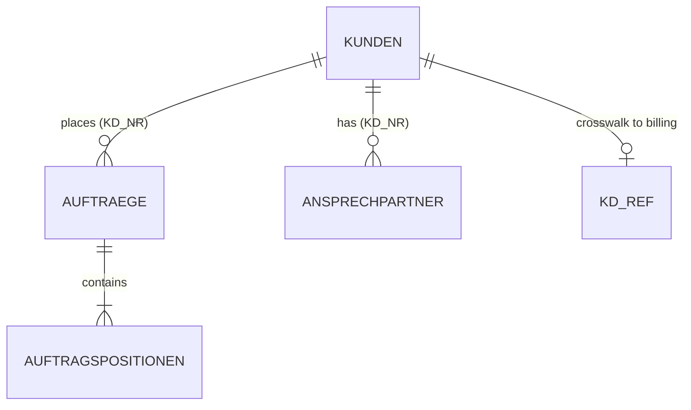
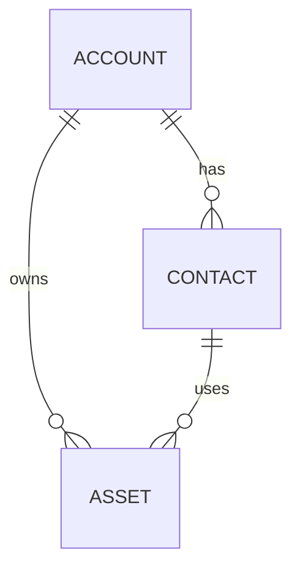

# Scenario — Acme Inc "Customer 360" Migration

> Orientation brief for anyone (human or agent) joining this work. Read this
> first: it explains the company, the systems involved, the goal, and the shape
> of the source and target data. The detailed analyses live in the companion
> documents in this folder (PRD, architecture overview, source-system analyses,
> governance register); this file is the map.

---

## The company

**Acme Inc** designs and sells industrial sensors across the DACH region
(Germany, Austria, Switzerland). It is headquartered in Munich and has roughly
25 years of trading history. Its customers are a mix of **companies** (the
majority — B2B) and **private individuals** (a smaller B2C tail).

## The goal

Acme has bought **Salesforce Sales Cloud** and wants a **"Customer 360"**: a
single, consolidated view in Salesforce of each customer together with their
contacts, their order history, their billing health, and their open support
tickets.

The work is a **data migration / integration project**: read customer and
billing data out of Acme's legacy systems, transform it to fit the Salesforce
data model, and load it. The central engineering artifact is a precise
**source-to-target mapping** — which source field becomes which target field,
under which transformation rule, with which governance treatment.

This is hard for three reasons that recur throughout the documents:

1. The legacy systems are old and under-documented; some columns have meanings
   nobody currently at Acme can fully explain.
2. The data is dirty in well-understood but non-trivial ways (invalid emails,
   inconsistent phone formats, identifiers that don't line up across systems).
3. It is personal data at scale moving to a new cloud recipient, so data
   protection and governance are first-class concerns, not an afterthought.

---

## The systems

| System | Kind | Role | Access |
|---|---|---|---|
| **ATLAS** | PostgreSQL OLTP, in-house, built ~1998 | System of record for customers and sales. German schema. | Direct DDL + read replica for profiling |
| **Billing platform** | Internal service | Subscriptions, monthly recurring revenue, dunning status | REST API only (`GET /v2/customers/{id}`) |
| **Support platform** | Internal service | Support tickets | REST API (**later phase — out of scope now**) |
| **Salesforce Sales Cloud** | Target SaaS | The Customer 360 destination | Metadata API + Bulk load API |

### Scope of the current phase

- **In:** Customers (ATLAS `KUNDEN`) → Salesforce Accounts and Contacts;
  billing subscriptions → Salesforce Assets.
- **Out (named so they aren't forgotten):** order history (`AUFTRAEGE`),
  support tickets, cross-system entity resolution / de-duplication, and ongoing
  incremental sync. The current phase is a one-shot historical migration of the
  customer + billing data.

---

## Source system 1 — ATLAS (PostgreSQL)

ATLAS is the system of record. Its tables and columns are named in German. The
customer sub-domain looks like this (only `KUNDEN` is in scope for this phase;
the rest is shown for context):



### The `KUNDEN` table (in scope) — DDL

```sql
-- ATLAS: public.kunden  (PostgreSQL). Customers since 1998.
CREATE TABLE kunden (
  kd_nr        INTEGER       NOT NULL,           -- customer number (primary key)
  anrede       CHAR(1),                          -- salutation code: H/F/D/X
  name1        VARCHAR(60),                      -- company name OR surname (overloaded)
  name2        VARCHAR(60),                      -- first name OR second name line
  vkz          CHAR(1),                          -- F = Firma (company), P = Privat (person)
  email        VARCHAR(120),
  telefon      VARCHAR(40),
  geb_datum    DATE,                             -- date of birth
  werbung_ok   CHAR(1)       DEFAULT 'N',        -- marketing consent: J (yes) / N (no)
  angelegt_am  TIMESTAMP     NOT NULL DEFAULT now(),
  CONSTRAINT pk_kunden PRIMARY KEY (kd_nr)
);
```

**Things to know about `KUNDEN`:**

- ~331,000 live rows. Customer numbers (`kd_nr`) are **not contiguous** — there
  are gaps from a 2009 archive purge.
- The coded columns (`anrede`, `vkz`, `werbung_ok`) have **no DB-level CHECK
  constraints**; their allowed values are convention, discovered by profiling:
  - `anrede`: `H` (Herr), `F` (Frau), `D` (Divers), and a small undocumented
    `X` (312 rows — meaning not recorded anywhere).
  - `vkz`: `F` = company, `P` = private person. This flag decides whether a row
    becomes a Salesforce **Account** (company) or **Contact** (person).
  - `werbung_ok`: `J`/`N`, marketing **consent** (defaults to `N`).
- `name1` is **overloaded**: it holds the company name when `vkz='F'` and the
  surname when `vkz='P'`.
- Data quality: ~4% of `email` values are invalid (mostly a trailing `;` from a
  2011 import); `telefon` is free text with ~19 different observed formats;
  `geb_datum` is populated for only ~12% of rows and has no obvious business
  purpose on a B2B sales system.

> See `03-atlas-source-analysis.md` for the full profiling report.

---

## Source system 2 — Billing platform (REST API)

Billing data is reachable only through a REST API. One call returns a customer
and all of their subscriptions as **nested JSON**:

```
GET /v2/customers/{id}      ->  200 application/json | 404 unknown customer
```

```yaml
# Response shape (OpenAPI 3.1, excerpt)
Customer:
  required: [customer_ref, payment_status]
  properties:
    customer_ref:   { type: string, maxLength: 20 }     # billing-side id (NOT the ATLAS kd_nr)
    payment_status: { type: string, enum: [ok, dunning_1, dunning_2, legal] }
    subscriptions:                                       # nested list
      type: array
      items:
        Subscription:
          required: [contract_no, product_code]
          properties:
            contract_no:  { type: string, maxLength: 15 }   # effective PK of a subscription
            product_code: { type: string, maxLength: 10 }
            mrr_eur:      { type: number, format: decimal }  # 10,2 — EUR only (single-currency)
            started_on:   { type: string, format: date }
            cancelled_on: { type: string, format: date, nullable: true }  # null while active
```

**Things to know about billing:**

- A customer has **many** subscriptions; each subscription must become one
  Salesforce **Asset**.
- `cancelled_on = null` means the subscription is **active**; otherwise it is
  cancelled. This drives the Asset status.
- **Identifier mismatch:** the billing `customer_ref` is **not** the ATLAS
  `kd_nr`. They are linked only through a separate **`KD-REF` crosswalk** table.
  About **0.4%** of billing refs are orphans (no ATLAS match) and must be routed
  to a manual remediation queue rather than dropped.
- The platform is **EUR-only**; no currency conversion is needed or wanted.

> See `04-billing-api-analysis.md` for the endpoint, an example response, and
> the crosswalk/join sequence.

---

## Target — Salesforce Sales Cloud

The Customer 360 maps onto three standard Salesforce objects:



- **Account** — one per customer; companies (`vkz='F'`) populate it.
  *(The Account-side mapping is in scope this phase but may be authored after
  Contact/Asset; Assets need an Account or Contact parent, so watch the
  ordering.)*
- **Contact** — natural persons (`vkz='P'`). Key fields:
  - `FirstName` ← `name2`, `LastName` ← `name1` (when `vkz='P'`; required).
  - `Salutation` — a **picklist** configured with `Herr | Frau | Divers |
    Familie`. (`Familie` exists specifically to receive the ATLAS `anrede='X'`
    rows once their meaning is confirmed.)
  - `Email` (PII — masked + encrypted at rest), `Phone` (PII — normalise to
    E.164).
  - `HasOptedOutOfEmail` — a boolean with the **opposite polarity** to the
    source consent flag: `werbung_ok='J'` → `false`, `'N'`/null → `true`.
- **Asset** — one per billing subscription. `SerialNumber` ← `contract_no`,
  `Product_Code__c` ← `product_code`, `MRR__c` ← `mrr_eur` (EUR), `Status` is an
  org-overridden picklist `Active | Cancelled` derived from `cancelled_on`.

> See `05-salesforce-target-model.md` for full field tables and picklist value
> sets. Note (Salesforce reality): picklist values and custom fields must exist
> in the target org before load — declaring them in a mapping does not create
> them.

---

## Constraints to respect

- **Personal data.** Customer rows must not leave Acme's network during
  analysis; profiling produces **aggregates and statistics only**. Email and
  phone are PII (mask + encrypt); a date-of-birth column with no clear purpose
  is a data-minimisation concern and is **not** migrated.
- **Consent.** The consent-flag inversion (above) is deliberate and must be
  reviewed — getting it wrong contacts people who opted out.
- **Single currency.** EUR only; no FX.
- **Auditability.** Every mapping decision — especially anything touching PII,
  consent, or retention — must be reviewable and attributable.
- **Identifier integrity.** Never silently drop the ~0.4% billing orphans;
  route them to remediation.

---

## What success looks like for this phase

1. Every in-scope source field is either mapped to a target field or explicitly
   recorded as *not* mapped, with a reason.
2. Every required target field is covered by a mapping or a documented default.
3. Every PII field has a governance decision (mask / encrypt / retention).
4. Every business rule (the salutation map, the consent inversion, the asset
   status derivation, the crosswalk join) is written down explicitly — testable,
   not implicit in code.
